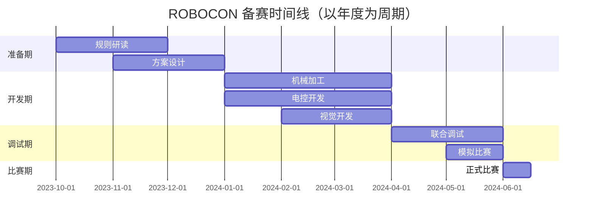

## 赛事简介

ROBOCON（全国大学生机器人大赛）是国内最具影响力的大学生机器人竞赛之一，每年举办一次，由不同主题的赛事组成。

## 备赛时间线



### 2026 年比赛日程


| 日期 | 时间 | 内容 | 地点 | 备注 |
|---|---|---|---|---|
| 7月9日 | 9:00-16:00 | 裁判员培训 | 李良宝体育馆 | 全体裁判员 |
| 7月10日 | 8:30-11:30 | 报到 | 国际交流中心门厅 | 按参赛校名单进入相应准备区 |
| 7月10日 | 8:30-22:00 | 准备时间（场地不开放） | 各相应准备区 | 参赛队自行组织 |
| 7月10日 | 9:00-16:00 | 拍摄定妆照 | 李良宝体育馆西门 | "武林探秘"及排球参赛队 |
| 7月10日 | 10:00-16:00 | 拍摄定妆照 | 国际交流中心 | 仿生足式参赛队 |
| 7月10日 | 16:00-17:30 | 领队会 | 李良宝体育馆 | 各赛项，每队最多2人 |
| 7月11日 | 8:30-19:00 | 参赛队适应场地 | 各场馆 | 由最先报到的7队自行组织，19:00后场地刷漆修整 |
| 7月12日 | 8:30-14:30 | "武林探秘"试运行 | 李良宝体育馆 | "武林探秘"1、2号场地 |
| 7月12日 | 15:00-17:41 | "武林探秘"预选赛（第一轮） | 李良宝体育馆 | "武林探秘"1、2号场地 |
| 7月12日 | 17:41-18:51 | "武林探秘"预选赛（第二轮） | 李良宝体育馆 | "武林探秘"1、2号场地 |
| 7月12日 | 8:30-17:00 | 仿生足式试运行 | 国际交流中心一层 | |
| 7月12日 | 8:30-14:06 | 机器人排球试运行 | 羽毛球馆二层 | |
| 7月12日 | 15:30-16:30 | 机器人排球热身赛 | 羽毛球馆二层 | |
| 7月12日 | 19:00-20:30 | 开幕式彩排 | 李良宝体育馆 | 每校1人，带4号校旗；20:30后武林探秘场地刷漆 |
| 7月13日 | 8:30-10:00 | "武林探秘"预选赛（第二轮续） | 李良宝体育馆 | "武林探秘"1、2号场地 |
| 7月13日 | 10:00-12:00 | 开幕式 | 李良宝体育馆 | 直播 |
| 7月13日 | 13:30-14:30 | "武林探秘"热身赛 | 李良宝体育馆 | "武林探秘"1号场地，直播 |
| 7月13日 | 15:00-19:00 | "武林探秘"小组赛 | 李良宝体育馆 | |
| 7月13日 | 8:30-18:24 | 仿生足式比赛（第一轮） | 国际交流中心一层 | 片段直播 |
| 7月13日 | 8:30-17:00 | 机器人排球小组赛 | 羽毛球馆二层 | 片段直播 |
| 7月13日 | 20:00-21:00 | 专家会议 | 待定 | 评审委员会全体 |
| 7月13日 | 19:00-21:00 | 草坪音乐会 | 足球场 | |
| 7月14日 | 8:30-16:08 | "武林探秘"小组赛（续） | 李良宝体育馆 | "武林探秘"1号场地，直播 |
| 7月14日 | 17:00-18:10 | "武林探秘"淘汰赛（16进8） | 李良宝体育馆 | 直播 |
| 7月14日 | 8:30-18:24 | 仿生足式比赛（第二轮） | 国际交流中心一层 | 片段直播 |
| 7月14日 | 8:30-11:00 | 机器人排球淘汰赛 | 羽毛球馆二层 | 片段直播 |
| 7月14日 | 19:00-20:30 | 闭幕式彩排 | 李良宝体育馆 | 每校1人，带4号校旗；20:30后武林探秘场地刷漆 |
| 7月15日 | 8:30-9:20 | "武林探秘"淘汰赛（8进4） | 李良宝体育馆 | 直播 |
| 7月15日 | 9:30-10:10 | "武林探秘"半决赛、决赛 | 李良宝体育馆 | 直播 |
| 7月15日 | 10:30-12:00 | 闭幕式及颁奖 | 李良宝体育馆 | 直播 |
| 7月15日 | 13:30-15:30 | 冠军队拍摄机器人检查视频 | 李良宝体育馆 | 冠军队全体 |
| 7月15日 | 14:30-17:30 | 青年工程师大会 | 比赛通知群中公布 | 各参赛队代表 |

<Note>
  注1：比赛日程难免会有变动，应随时关注公众号的通知。
  <br />
  注2：彩排、开闭幕式、论坛、交流等活动均为大赛重要组成部分，参赛队需参加所有日程活动。
</Note>

## 技术方案架构

<CardGroup cols={2}>
  <Card title="机械设计" icon="cogs" href="/mechanical/introduction">
    底盘设计、执行机构、传动方案
  </Card>
  <Card title="控制系统" icon="microchip" href="/embedded-software/introduction">
    运动控制、任务调度、通信协议
  </Card>
  <Card title="视觉识别" icon="eye" href="/vision/introduction">
    目标检测、定位导航、AprilTag
  </Card>
  <Card title="策略算法" icon="chess">
    路径规划、决策系统、对抗策略
  </Card>
</CardGroup>

## 备赛经验总结

### 机械部分

#### 底盘设计要点
- **全向轮 vs 麦轮**：根据场地特性选择，全向轮灵活性高，麦轮载重能力强
- **悬挂系统**：考虑场地平整度，预留 5-10mm 缓冲空间
- **重心控制**：尽量降低重心，提高稳定性

#### 执行机构
```
设计原则：
1. 模块化设计，便于快速更换
2. 预留调试余量（尺寸、力度）
3. 关键部位使用标准件，缩短加工周期
4. 考虑维修便利性，避免过度集成
```

### 电控部分

#### 控制架构
```cpp
// 分层控制架构示例
class RobotController {
    // 底层：电机驱动
    MotorDriver motors[4];
    
    // 中层：运动学解算
    Kinematics kinematics;
    
    // 上层：任务调度
    TaskScheduler scheduler;
    
    // 通信层
    CANBus canBus;
    UART visionUart;
};
```

#### 调试技巧
- **分模块调试**：先单电机，再底盘，最后整机
- **日志系统**：关键数据实时输出，便于问题定位
- **参数可调**：PID等参数支持在线调整

### 视觉部分

#### 常用方案
| 任务类型 | 推荐方案 | 帧率 | 精度 |
|---------|---------|------|------|
| 目标检测 | YOLOv5 | 60+ FPS | mAP>0.85 |
| 定位导航 | AprilTag | 30 FPS | ±5mm |
| 颜色识别 | HSV阈值 | 60+ FPS | 依赖光照 |

#### 部署优化
- 使用 TensorRT 加速推理
- 采用 ROI 裁剪减少计算量
- 多线程：采集与推理分离

### 团队协作

#### 人员分工
```
标准团队配置（8-10人）：
├── 机械组（3人）
│   ├── 底盘设计
│   └── 执行机构
├── 电控组（3人）
│   ├── 底层驱动
│   └── 控制算法
├── 视觉组（2人）
│   ├── 图像处理
│   └── 定位导航
└── 管理（1-2人）
    ├── 进度管理
    └── 文档整理
```

#### 项目管理工具
- **代码管理**：Git + Gitee/GitHub
- **文档协作**：飞书文档 / 腾讯文档
- **任务追踪**：Git Issues / Tower

## 常见问题 FAQ

<AccordionGroup>
  <Accordion title="Q: 第一次参赛，如何上手 NEC？">
    A: 建议先学习往届优秀开源方案（如武汉科技大学、电子科技大学），理解基本架构后再进行创新。同时加入社区交流群，向有经验的同学请教。
  </Accordion>
  <Accordion title="Q: 机械加工周期紧张怎么办？">
    A: 
    1. 提前联系加工厂，预约加工时间
    2. 采用 3D 打印快速验证结构
    3. 关键部件准备备份方案
    4. 考虑使用标准件减少加工量
  </Accordion>
  <Accordion title="Q: 比赛现场突发故障如何处理？">
    A:
    1. 准备常用备件（电机、轮子、螺丝等）
    2. 随身携带调试工具（电脑、烧录器）
    3. 赛前充分模拟，制定应急预案
    4. 保持冷静，快速定位问题
  </Accordion>
</AccordionGroup>

## 资源推荐

<CardGroup cols={2}>
  <Card title="ROBOCON 官网" icon="globe" href="https://www.cnrobocon.net/">
    获取最新规则与赛事信息
  </Card>
  <Card title="社区开源方案" icon="code" href="https://gitee.com/darrenpig/new_energy_coder_club">
    查看 NEC 社区开源代码
  </Card>
</CardGroup>

## 经验分享者

感谢以下社区成员贡献的备赛经验：
- @darrenpig - 机械设计总负责人
- @team-lead - 电控架构设计
- @vision-expert - 视觉算法优化

<Note>
  本文档持续更新中，如果你有更多经验想要分享，欢迎提交 PR！
</Note>
